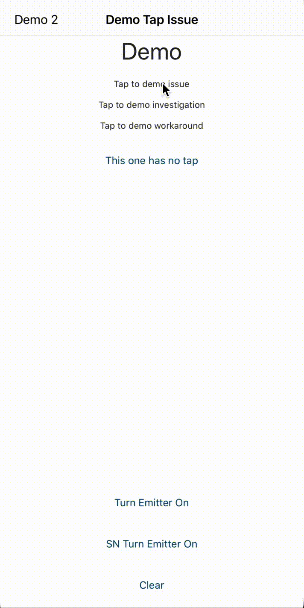
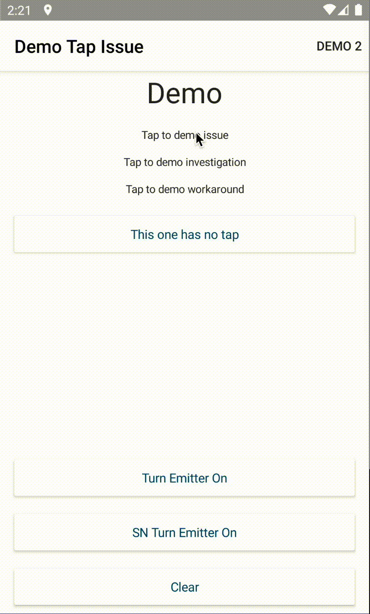

# Demo Tap Issue
## Issue
On Android I'm noticing multiple taps where I would not expect them.

## Demo
The demo code goes over a few scenarios. The top label is the instance I noticed this being a problem in.

| iOS (as expected)           | android (madness)                  |
| --------------------------- | ---------------------------------- |
|  |  |

### Layout

- (parent) Demo Component:
  - H1 Label (ignore).
  - child `tappable-label` component with `(tap)` bound to `demo-component.onTap`
    - Label with `(tap)` bound to `tappable-label.onTap` that emits on `tappable-label.tap`
      - _note:_ Here is the scenario that I expect to just work, the inner Tap on the label is bound to the component which emits on `(tap)` to the parent component (page).
      - _note:_ On android this actually leads to the parent's onTap running twice.
  - child `tappable-label-investigation` component with `(tap)` bound to `demo-component.onTap`
    - Label with no `(tap)` bound to it
      - _note:_ I assumed that the error seen in the above component might mean that I just need to bind to `(tap)` on the component.
      - _note:_ this actually leads to the parent.onTap not being run
  - child `tappable-label-workaround` component with `(tap)` bound to `demo-component.onTap`
    - Label with `(tap)` bound to a `noop` function
      - _note:_ this one is really odd, if in the child I bind the label to a noop function, the parent onTap is called once. (only on android).

## Running

```
npm i
ns platform add android && ns prepare android
npm run run:android
```
